# C4 — Level 2: Container view

> Author: Yanis Lounadi · 2026-04-27 · zoom inside the BagTrip system
> from `c4-context.md`. The diagram is intentionally limited to the
> BagTrip-managed surface — adjacent unrelated workloads on the host
> are out of scope.

```mermaid
graph TB
    subgraph external["External (Trust boundary 0-1)"]
        cf[Cloudflare]
        clients([users])
    end

    subgraph vps["OVH VPS — Ubuntu 25.04 / 8 vCPU / 31 GiB / 193 GiB"]
        subgraph edge["/opt/edge — Trust boundary 2"]
            ec[edge-caddy<br/>:443 → 8081/8082/8085/8087/8089]
        end

        subgraph prod["/opt/bagtrip — Trust boundary 3a (prod)"]
            pcaddy[bagtrip-caddy-1<br/>127.0.0.1:8081]
            padmin[bagtrip-admin-1<br/>Next.js 16.2.4]
            papi[bagtrip-api-1<br/>FastAPI + OTEL]
            ppg[bagtrip-postgres-1]
            pred[bagtrip-redis-1]
        end

        subgraph preprod["/opt/bagtrip-preprod — Trust boundary 3b (preprod)"]
            qcaddy[bagtrip-preprod-caddy-1<br/>127.0.0.1:8082]
            qadmin[bagtrip-preprod-admin-1]
            qapi[bagtrip-preprod-api-1]
            qpg[bagtrip-preprod-postgres-1]
            qred[bagtrip-preprod-redis-1]
        end

        subgraph obs["/opt/observability — Trust boundary 3c (observability)"]
            prom[(Prometheus<br/>30 d / 20 GB)]
            graf[Grafana 11.4]
            loki[(Loki 3.3<br/>14 d)]
            promt[Promtail]
            tempo[(Tempo 2.7<br/>14 d)]
            am[Alertmanager]
            ne[node_exporter]
            ca[cAdvisor]
            bb[blackbox_exporter]
            pe1[postgres_exporter ×2]
            re1[redis_exporter ×2]
            falco[Falco<br/>profile: security]:::dim
        end

        subgraph host["Host services"]
            netd[Netdata<br/>monitoring.bagtrip.fr]
            crowd[CrowdSec<br/>+ firewall-bouncer]
            ipt[iptables<br/>+ netfilter-persistent]
            sd[systemd<br/>restic-backup.timer<br/>restic-restore-test.timer]
            restic[(restic repo<br/>/var/backups/bagtrip-restic)]
        end
    end

    clients --> cf
    cf -->|TLS origin cert| ec

    ec -->|Host header bagtrip.fr / api.bagtrip.fr| pcaddy
    ec -->|Host header dev.bagtrip.fr / api.dev.bagtrip.fr| qcaddy
    ec -->|monitoring.bagtrip.fr<br/>basic_auth| netd
    ec -->|grafana.bagtrip.fr<br/>basic_auth| graf
    ec -->|:8089 metrics| prom

    pcaddy --> padmin
    pcaddy --> papi
    qcaddy --> qadmin
    qcaddy --> qapi
    papi --> ppg
    papi --> pred
    qapi --> qpg
    qapi --> qred

    prom -->|scrape| ne
    prom -->|scrape| ca
    prom -->|scrape| pe1
    prom -->|scrape| re1
    prom -->|scrape| bb
    prom -->|scrape /metrics| papi
    prom -->|scrape /metrics| qapi
    prom -->|scrape /api/metrics| padmin
    prom -->|scrape /api/metrics| qadmin
    prom -->|scrape| ec

    promt -->|push| loki
    papi -->|OTLP gRPC| tempo
    qapi -->|OTLP gRPC| tempo
    prom -->|scrape| tempo

    graf -->|datasource| prom
    graf -->|datasource| loki
    graf -->|datasource| tempo
    graf -->|datasource| am

    am -.->|webhook| cf

    sd -->|pg_dump + restic backup| ppg
    sd -->|pg_dump + restic backup| qpg
    sd --> restic
    sd -->|metrics textfile| ne

    crowd --> ipt

    classDef dim fill:#fff,stroke:#999,color:#666,stroke-dasharray: 4 4;
```

## Reading the diagram

- **Trust boundaries** are aligned with the threat-model
  (`documentations/security/threat-model.md`). Boundaries 0-2 are at
  the edge; 3a / 3b / 3c are per-stack inside the VPS; 4 (kernel) is
  the implicit container; outside everything.
- **Falco** is dashed because it ships as config but its container is
  tagged with the `security` compose profile and is not running on the
  current kernel (runtime deferred — Linux 6.14 eBPF probe issue).
- **Out of scope**: any non-BagTrip workload on the same VPS. The host
  has other tenants; they share `node_exporter` host-level metrics
  visibility but never enter our Loki index, our cAdvisor scrape
  results, or our backup repo.

## Per-container summary

| Container | Image | Mounts | Networks |
|---|---|---|---|
| `edge-caddy` | `caddy:2-alpine` | `/opt/edge:/etc/caddy:ro`, `/opt/edge/logs:/var/log/caddy:rw` | `host` |
| `bagtrip-caddy-1` | `caddy:2-alpine` | `./Caddyfile:/etc/caddy/Caddyfile:ro` | `bagtrip_default` |
| `bagtrip-admin-1` | `bagtrip-admin` (next.js standalone, hardened) | `tmpfs:/tmp:noexec`, `tmpfs:/app/.next/cache` | `bagtrip_default` |
| `bagtrip-api-1` | `bagtrip-api` (uv multi-stage) | volumes inherited from compose | `bagtrip_default` |
| `bagtrip-postgres-1` | `postgres:15-alpine` | `postgres_data:/var/lib/postgresql/data` | `bagtrip_default` |
| `observability-prometheus` | `prom/prometheus:v2.55.1` | dir-mounted config + named volume | `default + bagtrip_default + bagtrip-preprod_default` |
| `observability-grafana` | `grafana/grafana:11.4.0` | provisioning + dashboards | `default` |
| `observability-loki` | `grafana/loki:3.3.2` | dir-mounted config + named volume | `default` |
| `observability-tempo` | `grafana/tempo:2.7.1` | dir-mounted config + named volume | `default + bagtrip_default + bagtrip-preprod_default` |
| `observability-promtail` | `grafana/promtail:3.3.2` | docker socket + edge logs | `default` |
| `observability-alertmanager` | `prom/alertmanager:v0.27.0` | dir-mounted config + named volume | `default` |

(See `infra/ansible/roles/observability_stack/templates/compose.yml.j2`
for the canonical version.)
