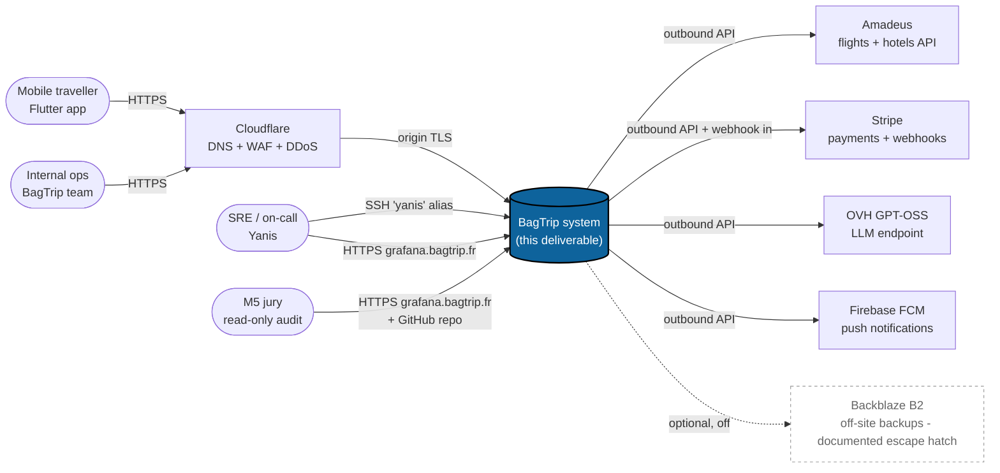

# C4 — Level 1: System context

> Author: Yanis Lounadi · 2026-04-27 · part of the Phase 9 documentation
> set. The diagram below is GitHub-rendered Mermaid; PNG / SVG can be
> exported via Excalidraw or Structurizr if needed for the slide deck.

## Outside the perimeter

- **Cloudflare** terminates DNS for every public hostname under
  `bagtrip.fr` and most other BagTrip-related domains. It absorbs
  L3/L4 DDoS and runs the free-tier WAF. We do not configure it via
  IaC in this deliverable; secret-of-trust accepted.
- **Amadeus** (test mode) supplies flight + hotel inventory.
- **Stripe** handles payments; webhooks come back into the API at
  `/v1/stripe/...`.
- **OVH GPT-OSS** is the LLM endpoint behind the trip planner.
- **Firebase FCM** delivers push notifications to the Flutter app.
- **Backblaze B2** is the documented off-site escape hatch for
  Restic. Off by default — local repo is the M5-phase deployment
  (see ADR-0005).

## Roles

- **Mobile traveller** uses the Flutter app to plan + manage trips.
- **Internal ops** uses the Next.js admin to triage user / trip /
  payment issues; it is the single highest-value compromise target.
- **SRE / on-call** is one person at the M5 phase (the author).
  Reaches the VPS via SSH and Grafana via HTTPS.
- **M5 jury** has read-only access to Grafana (`grafana.bagtrip.fr`,
  Caddy basic_auth + Grafana login) and the GitHub repository.

## What "the system" means

`bagtrip` in the diagram is everything inside the OVH VPS that this
deliverable manages: prod stack, preprod stack, edge Caddy, the
observability stack. See `c4-containers.md` for the level-2
breakdown.
